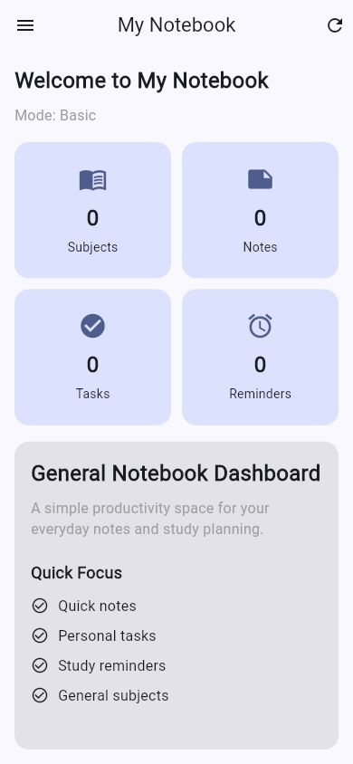
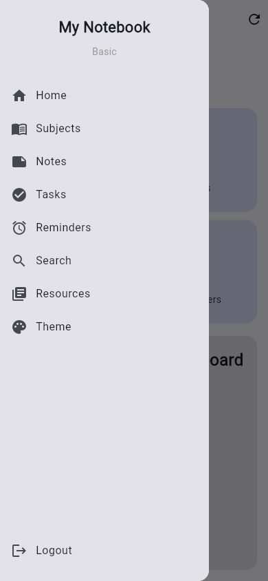
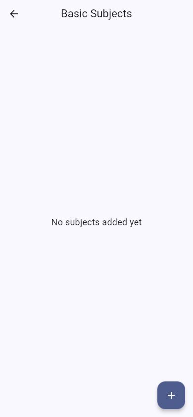
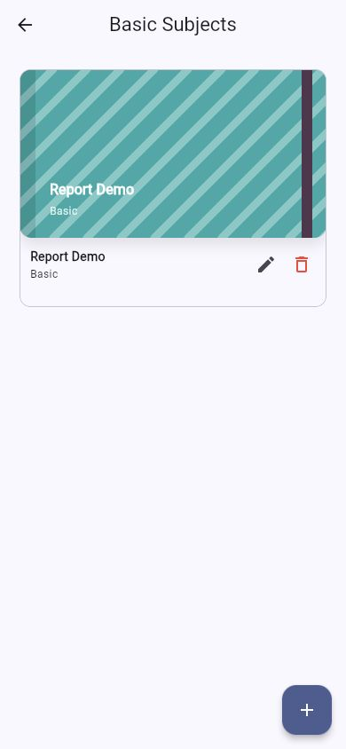
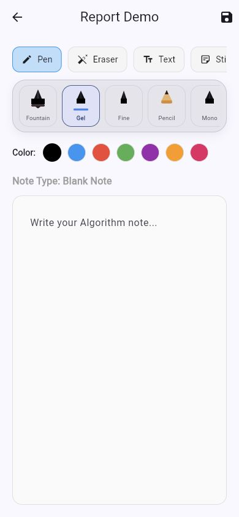
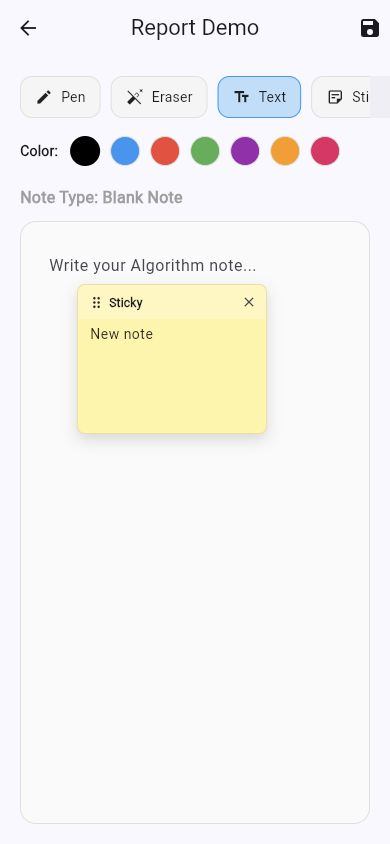

# My Notebook

A Flutter notebook and study-planning app for students who want subjects, notes, tasks, reminders, study resources, themes, and local backup in one workspace.

The project is built around a local-first workflow: users create an account, choose a study mode, create subject notebooks, write or draw notes, attach sticky notes and emoji stickers, track tasks, set reminders, search saved work, and export their field-specific notebook data.

---

## Demo Video

Demo video link: [https://youtu.be/Wm1ZVsdwsjw](https://youtu.be/Wm1ZVsdwsjw)

Suggested walkthrough:

1. Create an account and sign in.
2. Choose a study mode, then show how to change it later.
3. Create a subject and choose a notebook cover.
4. Open a subject, create a new note, and select a note type.
5. Demonstrate pen types, eraser sizes, text, sticky notes, emoji stickers, and save.
6. Add a task, a reminder, use search, change the theme, and open backup.

---

## Screenshots

| Home dashboard | Navigation drawer | Subjects |
| --- | --- | --- |
|  |  |  |

| Subject covers | Note editor | Sticky notes and stickers |
| --- | --- | --- |
|  |  |  |

---

## Tech Stack

### Application

- Flutter
- Dart
- Material 3

### Local Storage

- SQLite through `sqflite` for native builds
- `shared_preferences` for session state, theme choice, and the web storage adapter
- User-scoped records using the active account email

### Testing

- Flutter widget tests
- Form validation tests
- Password hashing tests
- Web database adapter tests
- Backup repository tests

---

## Project Structure

```text
My_Notebook/
|-- android/                 # Android platform project
|-- ios/                     # iOS platform project
|-- macos/                   # macOS platform project
|-- web/                     # Flutter web shell
|-- docs/
|   |-- report_assets/       # README and report screenshots
|   |-- CEN306_*.docx        # Project report files
|   `-- CEN306_*.pdf
|-- lib/
|   |-- controllers/         # UI-facing controllers
|   |-- dao/                 # Data access classes
|   |-- database/            # SQLite/native and web database adapters
|   |-- models/              # Data models
|   |-- repositories/        # Business logic and data coordination
|   |-- screens/             # App screens
|   |-- utils/               # Validators and password hashing
|   |-- widgets/             # Reusable UI widgets
|   `-- main.dart            # App entry point
|-- test/                    # Automated tests
|-- pubspec.yaml
`-- README.md
```

---

## Features Checklist

### Authentication and Session

- [x] Sign up with full name, email, password, and password confirmation
- [x] Login with email validation and required password validation
- [x] Remember-me session behavior
- [x] Forgot-password reset for local accounts
- [x] PBKDF2 SHA-256 password hashing for newly saved passwords
- [x] Legacy plain-text password upgrade support on successful login

### Study Modes

- [x] Basic mode
- [x] Business mode
- [x] Engineering mode
- [x] Medicine mode
- [x] Change mode from the home dashboard
- [x] Persist selected mode per user account

### Notebook Workspace

- [x] Dashboard counts for subjects, notes, tasks, and reminders
- [x] Recent notebook shelf on the home screen
- [x] Subject creation, editing, and deletion
- [x] Notebook cover color and pattern selection
- [x] Multiple notes per subject
- [x] Continue an existing note or create a new note when opening a subject
- [x] Blank, lined, grid, and template note types

### Note Editor

- [x] Text note area with a clean placeholder
- [x] Drawing canvas
- [x] Multiple pen types
- [x] Pen colors and stroke thickness controls
- [x] Eraser with visual size choices
- [x] Undo and clear drawing actions
- [x] Sticky notes that can be attached to the page
- [x] Emoji stickers that can be attached to the page
- [x] Unsaved-change warning before leaving a note with new content
- [x] Summary, revision, study-note, diagram, algorithm, and pseudocode template chips

### Productivity Tools

- [x] Tasks
- [x] Reminders
- [x] Search across saved notebook data
- [x] Field-aware resources and study prompts
- [x] Theme color selector
- [x] Field and user-scoped backup export
- [x] Copy backup JSON without displaying raw code as the main page content

---

## Local Data Model

| Table | Purpose | Main scope |
| --- | --- | --- |
| `users` | Local account details and hashed passwords | Email |
| `subjects` | Subject notebooks with covers | Field and user email |
| `notes` | Note content, note type, drawing data, page elements | Field and user email |
| `tasks` | Study tasks and completion state | Field and user email |
| `reminders` | Dated reminders | Field and user email |

The backup feature exports subjects, notes, tasks, and reminders for the active user and selected field. It does not export user passwords.

---

## How to Run the Project

### 1. Install dependencies

```bash
flutter pub get
```

### 2. Run natively

Use any connected simulator, emulator, or supported desktop target:

```bash
flutter devices
flutter run
```

### 3. Run on Chrome web

```bash
flutter run -d chrome
```

### 4. Build for web

```bash
flutter build web
```

---

## Quality Checks

Run these before submitting or recording the demo:

```bash
flutter analyze
flutter test
flutter build web
```

If Flutter is not available on your shell `PATH`, run the same commands with the full path to your Flutter SDK.

---

## Current Limitations

- Data is local to the device/browser storage; there is no cloud sync yet.
- Forgot password resets a local account only; it does not send an email.
- Backup export is implemented, but restore/import is not part of the current app scope.
- App Store and Google Play release setup should be handled after the school submission, with production signing, app icons, privacy text, and store metadata.

---

## Project Status

This app is currently prepared as a school project submission build. The core notebook workflow, local authentication, user-scoped storage, note tools, resources, theme selection, backup export, and tests are in place.
